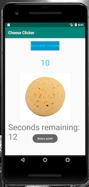

# My First Android Application

## The Cheese Clicker 

# Tools and Technologies Used
- Java
- Android Studio
- Git

### In a Future Iteration of this Project, I would Like to...
* Make a welcome screen that they start with and can go back to when they've finished playing
* Make a widget/icon for the app in user's application menu
* Let the users log in and put scores on a leaderboard
* Change the cheese each time the user reaches a multiple of 100 points
* Add a background image
